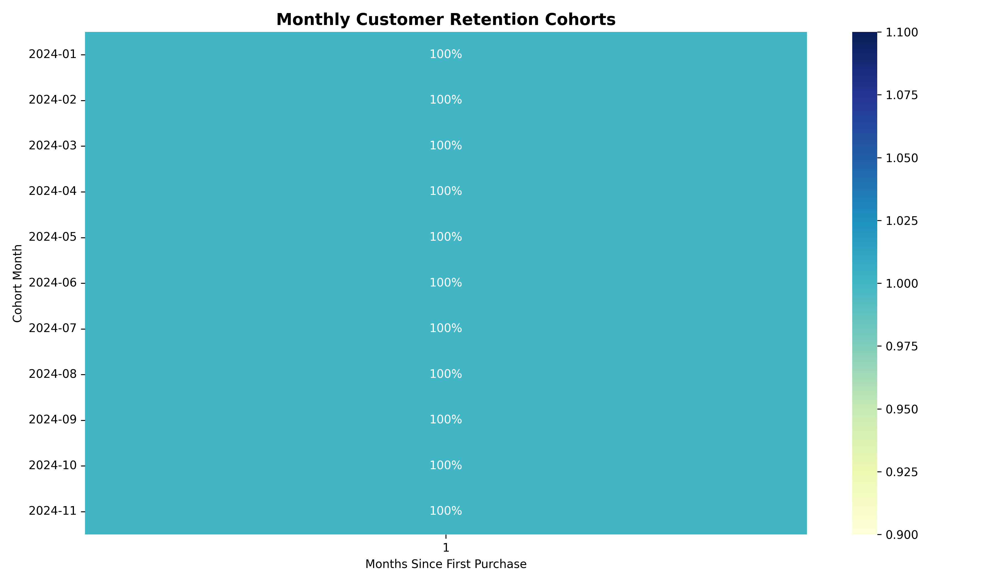

# 🛒 E-Commerce Customer Analytics & Revenue Intelligence Pipeline

An end-to-end data analytics project featuring an interactive executive dashboard, SQL RFM customer segmentation, and Python cohort retention modeling on 2,710 transaction records.

---

## 📈 Customer Retention Cohort Analysis (Python)



### Key Retention Insights:
* **Initial Retention Drop-off**: Customer retention drops significantly after Month 1 across most cohorts.
* **Long-Term Value (LTV)**: Tracking cohort engagement over time helps evaluate marketing acquisition channels and customer lifetime value.

---

## 🎯 RFM Customer Segmentation (SQL)

Using PostgreSQL window functions (`NTILE`), customers are segmented into actionable business tiers based on **Recency**, **Frequency**, and **Monetary** value:

* **Champions**: High recency, high frequency, and high overall spend.
* **Loyal Customers**: Frequent buyers with consistent order patterns.
* **At-Risk / Churn Risk**: High historic order volume who have not purchased recently.
* **Lost Customers**: Low overall engagement and low spend.

---

## 🛠️ Tech Stack & Methodology

* **Google Sheets**: Dynamic Pivot Tables, Dual-Axis Combo Charts, Interactive Slicers, KPI Scorecards.
* **SQL (PostgreSQL/BigQuery)**: CTEs, Aggregations, Window Functions (`NTILE`).
* **Python (`pandas`, `seaborn`, `matplotlib`)**: Data parsing, Cohort matrix calculation, Heatmap visualization.

---

## 📁 Repository Structure

```text
├── ecommerce_dataset_updated.csv             # Raw dataset (2,710 records)
├── Ecommerce_Customer_Cohort_Analysis.ipynb  # Jupyter Notebook (Google Colab)
├── cohort_retention_heatmap.png              # Python seaborn heatmap output
├── ecommerce_dataset_updated - Pivot Table 1 # Executive Dashboard PDF
├── sql/
│   └── 01_rfm_segmentation.sql               # RFM SQL Segmentation query
└── README.md                                 # Project documentation
